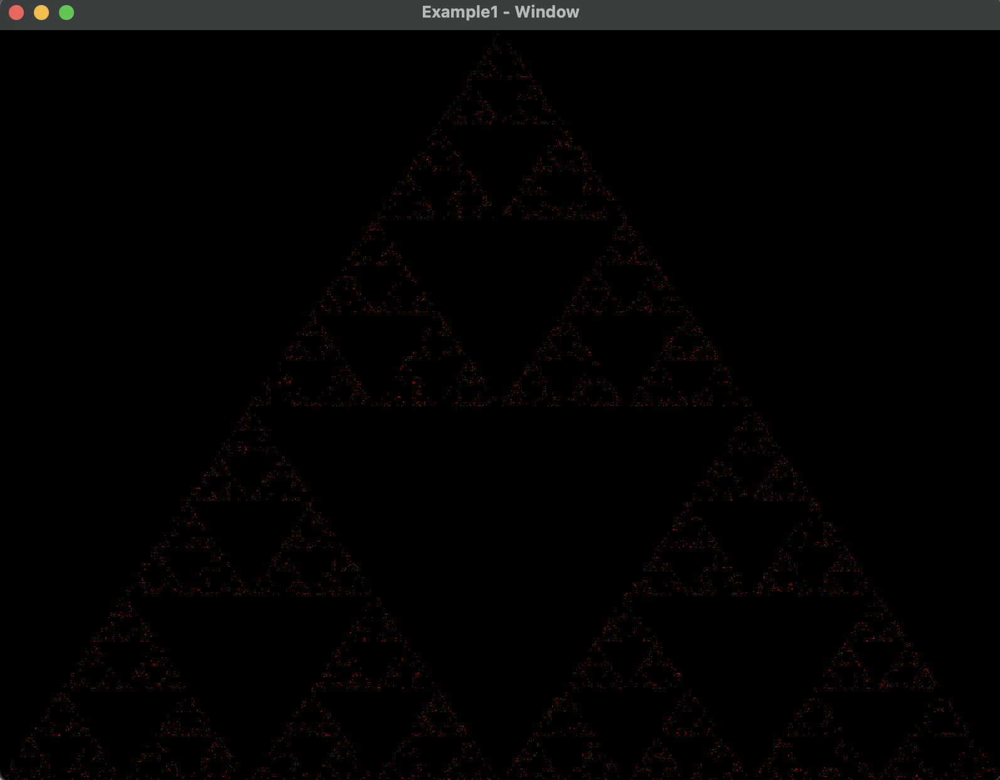

# shader-demo

This is an OpenGL demonstration, which has been refined using the source code from the book [Interactive Computer Graphics 6E](https://www.cs.unm.edu/~angel/BOOK/INTERACTIVE_COMPUTER_GRAPHICS/SIXTH_EDITION/CODE/).

## Dependencies

* [glfw](https://github.com/glfw/glfw)

## Build

`cd ./demo`

`make`
